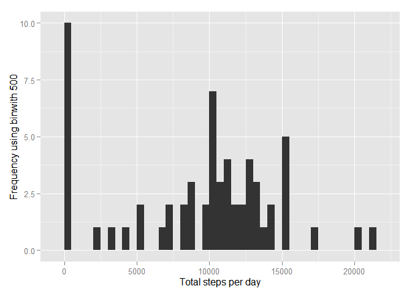
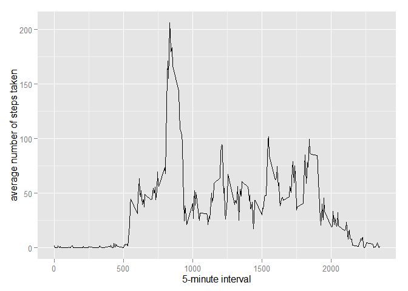
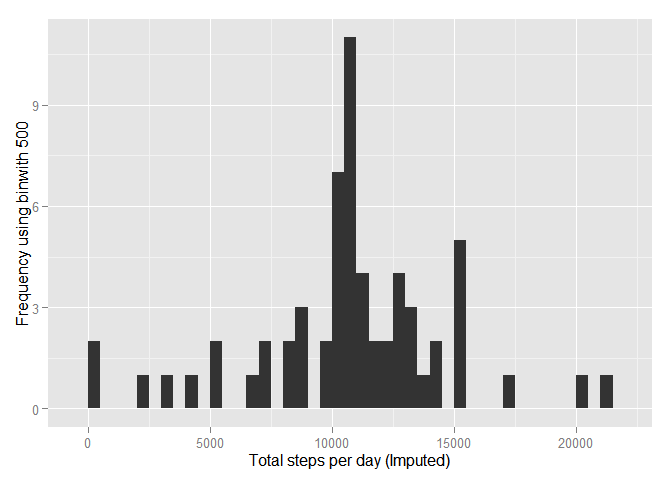
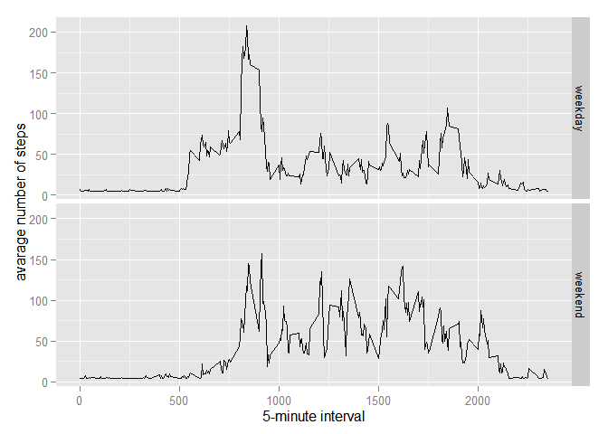

# Reproducible Research: Peer Assessment 1

Libraries Utilized: ggplot2, scales, and Hmisc

```r
library(ggplot2)
library(scales)
library(Hmisc)
```

```
## Loading required package: grid
## Loading required package: lattice
## Loading required package: survival
## Loading required package: Formula
## 
## Attaching package: 'Hmisc'
## 
## The following objects are masked from 'package:base':
## 
##     format.pval, round.POSIXt, trunc.POSIXt, units
```

## Loading and preprocessing the data

1. Load the data (i.e. read.csv())


```r
if(!file.exists('activity.csv')){
    unzip('activity.zip')
}
activityData <- read.csv('activity.csv')
```

## What is mean total number of steps taken per day?


```r
stepsPerDay <- tapply(activityData$steps, activityData$date, sum, na.rm=TRUE)
```

For this part of the assignment, you can ignore the missing values in the dataset.

1. Make a histogram of the total number of steps taken each day


```r
qplot(stepsPerDay, xlab='Total steps per day', ylab='Frequency using binwith 500', binwidth=500)
```

 

2. Calculate and report the mean and median total number of steps taken per day

Calculation:

```r
stepsPerDayMean <- mean(stepsPerDay)
stepsPerDayMedian <- median(stepsPerDay)
```

Report:

* Mean: 

```r
stepsPerDayMean
```

```
## [1] 9354.23
```

* Median:

```r
stepsPerDayMedian
```

```
## [1] 10395
```

## What is the average daily activity pattern?

```r
averageStepsPerTimeBlock <- aggregate(x=list(meanSteps=activityData$steps), by=list(interval=activityData$interval), FUN=mean, na.rm=TRUE)
```

1. Make a time series plot (i.e. type = "l") of the 5-minute interval (x-axis) and the average number of steps taken, averaged across all days (y-axis)


```r
ggplot(data=averageStepsPerTimeBlock, aes(x=interval, y=meanSteps)) +
    geom_line() +
    xlab("5-minute interval") +
    ylab("average number of steps taken") 
```

 

2. Which 5-minute interval, on average across all the days in the dataset, contains the maximum number of steps?

Calculation:

```r
maxSteps <- which.max(averageStepsPerTimeBlock$meanSteps)
timeMaxSteps <-  gsub("([0-9]{1,2})([0-9]{2})", "\\1:\\2", averageStepsPerTimeBlock[maxSteps,'interval'])
```

Report:

* 5-Minute Interval Time:

```r
timeMaxSteps
```

```
## [1] "8:35"
```

## Imputing missing values

1. Calculate and report the total number of missing values in the dataset (i.e. the total number of rows with NAs)

Calculation:

```r
numMissingValues <- length(which(is.na(activityData$steps)))
```

Report:

* Number of Missing Values:

```r
numMissingValues
```

```
## [1] 2304
```

2. Devise a strategy for filling in all of the missing values in the dataset. The strategy does not need to be sophisticated. For example, you could use the mean/median for that day, or the mean for that 5-minute interval, etc.

Devised Strategy executed: Mean for that day

3. Create a new dataset that is equal to the original dataset but with the missing data filled in.


```r
activityDataImputed <- activityData
activityDataImputed$steps <- impute(activityData$steps, fun=mean)
```

4. Make a histogram of the total number of steps taken each day and Calculate and report the mean and median total number of steps taken per day. 

Histogram:

```r
stepsPerDayImputed <- tapply(activityDataImputed$steps, activityDataImputed$date, sum)
qplot(stepsPerDayImputed, xlab='Total steps per day (Imputed)', ylab='Frequency using binwith 500', binwidth=500)
```

 

Calculation:

```r
stepsPerDayMeanImputed <- mean(stepsPerDayImputed)
stepsPerDayMedianImputed <- median(stepsPerDayImputed)
```

Report:

* Mean:

```r
stepsPerDayMeanImputed
```

```
## [1] 10766.19
```

* Median:

```r
stepsPerDayMedianImputed
```

```
## [1] 10766.19
```

### Do these values differ from the estimates from the first part of the assignment?

Yes these values differ from the estimates form the first part of the assignment. Compared to the unimputed mean values of 9354.23 and unimputed median of 10395, the imputed mean and median are both higher at 10766.19 steps per day.

### What is the impact of imputing missing data on the estimates of the total daily number of steps?

The impact of imputing missing data on the estimates of the total daily number of steps is a higher mean and median, which overfits the data higher than it really is. At the same time, this imputation has set both the mean and median to equal each other, gaining stronger accuracy and precision.

## Are there differences in activity patterns between weekdays and weekends?

1. Create a new factor variable in the dataset with two levels -- "weekday" and "weekend" indicating whether a given date is a weekday or weekend day.


```r
activityDataImputed$dateType <-  ifelse(as.POSIXlt(activityDataImputed$date)$wday %in% c(0,6), 'weekend', 'weekday')
```

2. Make a panel plot containing a time series plot (i.e. type = "l") of the 5-minute interval (x-axis) and the average number of steps taken, averaged across all weekday days or weekend days (y-axis). The plot should look something like the following, which was created using simulated data:


```r
averagedActivityDataImputed <- aggregate(steps ~ interval + dateType, data=activityDataImputed, mean)
ggplot(averagedActivityDataImputed, aes(interval, steps)) + 
    geom_line() + 
    facet_grid(dateType ~ .) +
    xlab("5-minute interval") + 
    ylab("avarage number of steps")
```

 
